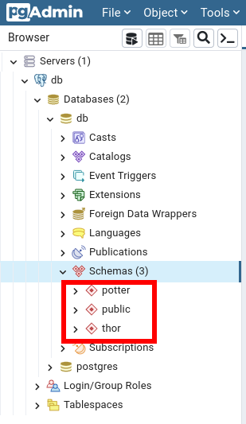

# django-tenant-isolated-schema

Tenant Shared database with isolated schema

https://books.agiliq.com/projects/django-multi-tenant/en/latest/shared-database-isolated-schema.html#


## This project was done with:

* [Python 3.10.4](https://www.python.org/)
* [Django 4.0.6](https://www.djangoproject.com/)
* [Bootstrap 4.0](https://getbootstrap.com/)

## How to run project?

* Clone this repository.
* Create virtualenv with Python 3.
* Active the virtualenv.
* Install dependences.
* Run the migrations.

```
git clone https://github.com/rg3915/django-tenant-isolated-schema.git
cd django-tenant-isolated-schema
python -m venv .venv
source .venv/bin/activate
pip install -r requirements.txt
python contrib/env_gen.py

docker-compose up -d

python manage.py migrate_schemas

python tenant_context_manage.py thor createsuperuser --username="admin"
python tenant_context_manage.py potter createsuperuser --username="admin"

python manage.py runserver
```

## Docker

```
docker-compose up -d
```


### pgAdmin

view pgAdmin on port 0.0.0.0:5050


## Schemas

View schemas definition on `backend.tentant.utils.py`

```python
# backend.tentant.utils.py
def get_tenants_map():
    return {
        "thor.localhost": "thor",
        "potter.localhost": "potter",
    }
```

## Use migrate_schemas

```
python manage.py migrate_schemas
```

Step by step to create commands.

```
python manage.py create_command core -n migrate_schemas
python manage.py create_command core -n migrate
```


## Create super user for each schema

```
python tenant_context_manage.py thor createsuperuser --username="admin"
python tenant_context_manage.py potter createsuperuser --username="admin"
```


## shell_plus

Require [django-extensions](https://django-extensions.readthedocs.io/en/latest/)

```
python tenant_context_manage.py thor shell_plus

Member.objects.create(name='Thor')
Member.objects.create(name='Jane')
```


```
python tenant_context_manage.py potter shell_plus

Member.objects.create(name='Harry')
Member.objects.create(name='Hermione')
Member.objects.create(name='Weasley')
```


## endpoints

Run normal

```
python manage.py runserver
```

thor.localhost:8000

potter.localhost:8000


### Admin

thor.localhost:8000/admin

potter.localhost:8000/admin




