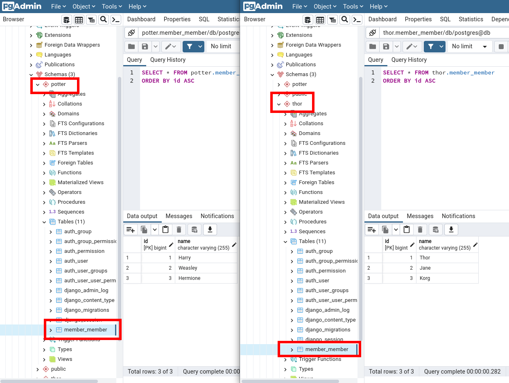

# django-tenant-isolated-schema

Tenant Shared database with isolated schema

https://books.agiliq.com/projects/django-multi-tenant/en/latest/shared-database-isolated-schema.html#


## Docker

docker-compose up -d


### pgAdmin

view pgAdmin on port 0.0.0.0:5050


## Schemas

View schemas definition on `backend.tentant.utils.py`

```python
# backend.tentant.utils.py
def get_tenants_map():
    return {
        "thor.localhost": "thor",
        "potter.localhost": "potter",
    }
```

## Use migrate_schemas

python manage.py migrate_schemas


python manage.py create_command core -n migrate_schemas
python manage.py create_command core -n migrate


## Create super user for each schema

python tenant_context_manage.py thor createsuperuser --username="admin"
python tenant_context_manage.py potter createsuperuser --username="admin"


## shell_plus

Require [django-extensions](https://django-extensions.readthedocs.io/en/latest/)

```
python tenant_context_manage.py thor shell_plus
python tenant_context_manage.py potter shell_plus
```


## endpoints

Run normal

```
python manage.py runserver
```

thor.localhost:8000

potter.localhost:8000


### Admin

thor.localhost:8000/admin

potter.localhost:8000/admin



